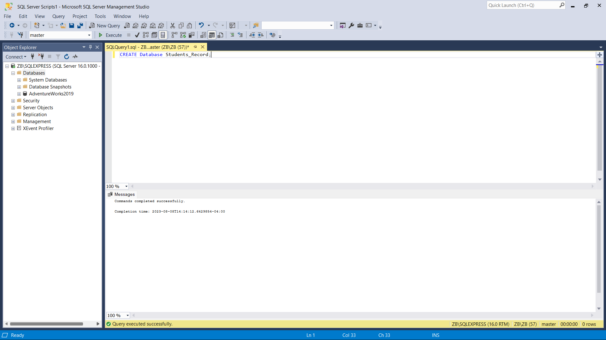
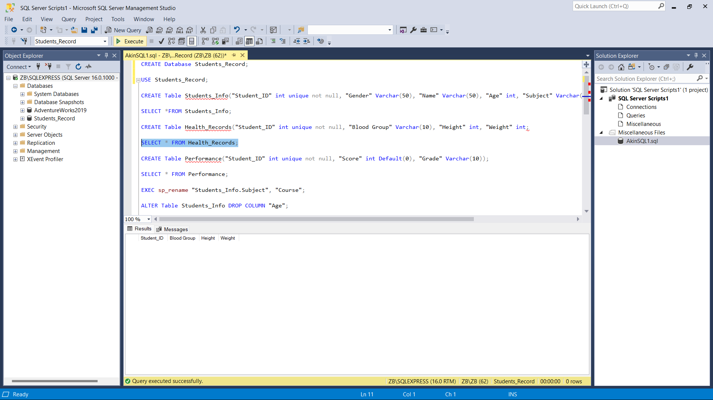
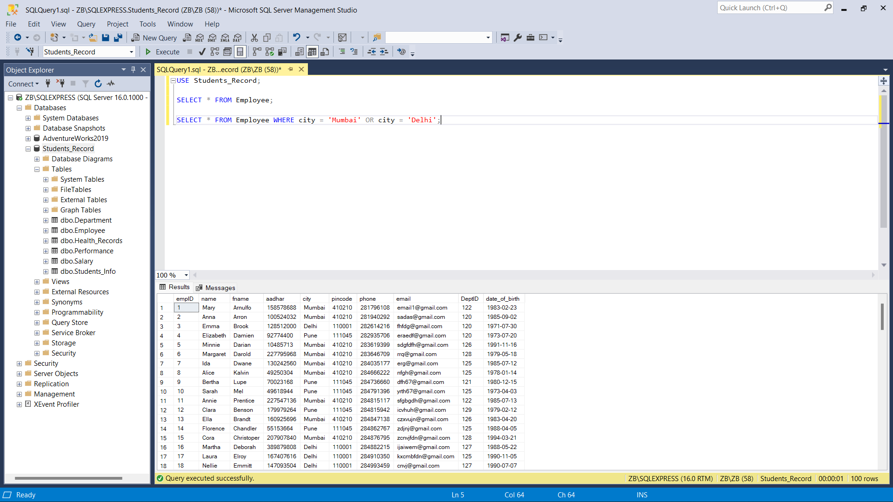
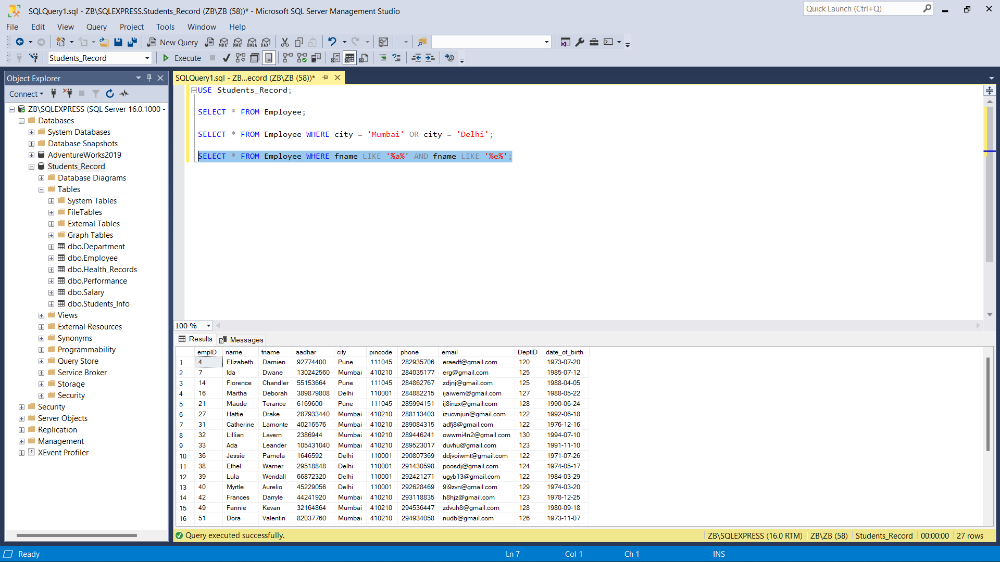
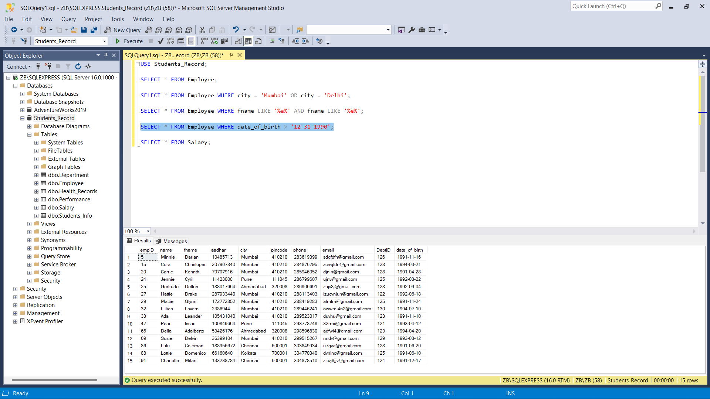
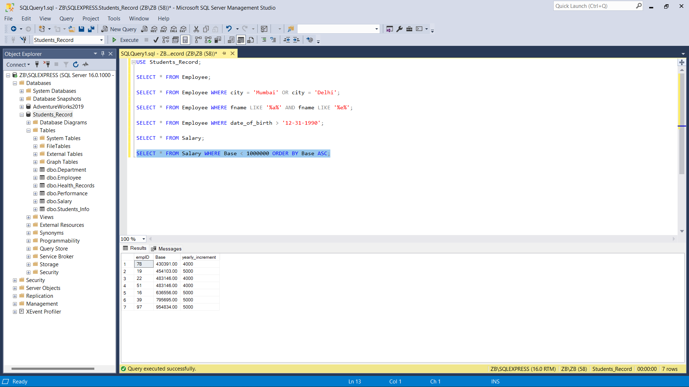
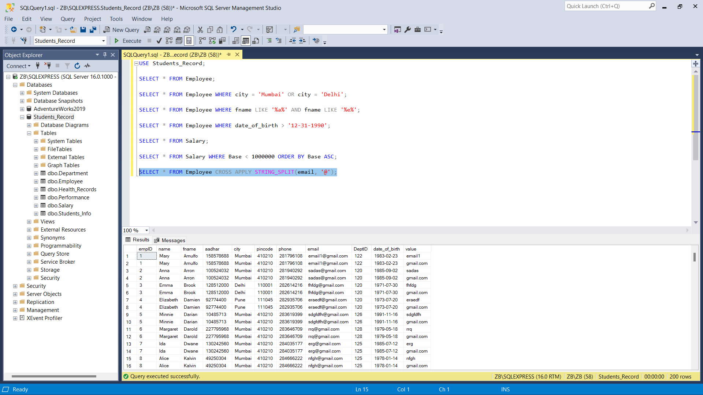
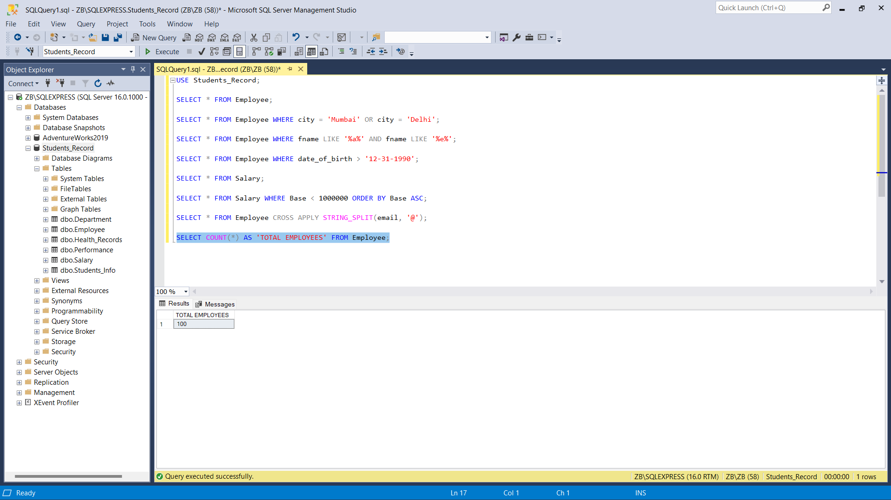
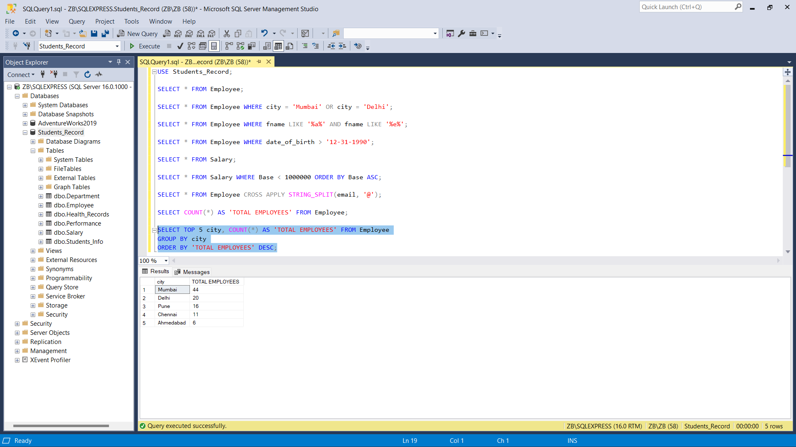
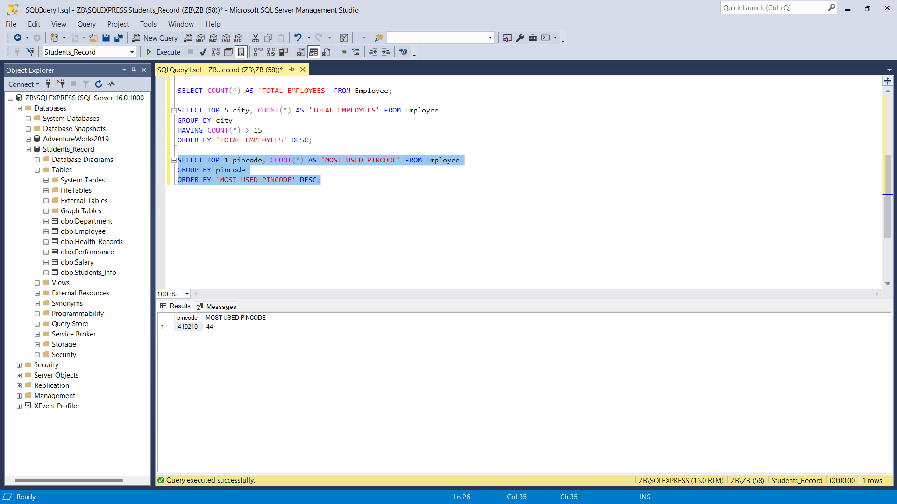

# SQL_Basics 🧰

## Questions❔
I will be answering the following questions in SQL:
- Create a Database named “Students Record”
- Create the following tables in the database create
  - Students Info  (Student ID, Gender, Name, Age, Subject)
  - Health records (Student ID, Blood Group, Height, Weight)
  - Performance (Student ID, Score, Grade)
---
_**NOTE:**_
- The ID has to be unique
- Where a student has no score, it should be ‘0’ by default
- Add a constraint that prevents the ID and Subject from taking null values
---
Apply the following modifications to the table:
- Change column name ‘’Subject” to ‘’Course” 
- Drop the “Age” column from the ‘Students Info’ table
---
- Select the employee table and show the data where the city is Mumbai and Delhi.
- Select the employee table where the employee's first name has both ‘a’ and ‘e’ in them.
- Subset the employee table to have employees with the date of birth above 1990
- Subset the salary table to show salaries less than 1 million and sort in an ascending order
- Modify the email column of the employee table to contain just email without ‘@gmail.com’
- What is the total number of employees in our employee table??
- Find out the top 5 cities with the highest number of employees, then filter the result to show cities with more than 15 employees.
- Find out the most used pin code by the employee. In this case, we want to know the pin codes that are used the most.  

## Answers
To create the database, I ran the following query `CREATE Database Students_Record;` and got the following prompt to get the feedback that the database was successfully created.

---
Following the instructions set, I created the tables:
- For the _Students Info_ table, I used the following query `CREATE Table Students_Info("Student_ID" int unique not null, "Gender" Varchar(50), "Name" Varchar(50), "Age" int, "Subject" Varchar(50) not null);`
The _Student_ID_ column has a data type _int_ which means integer, it was specified in the instruction that it has to be unique and should not take null values hence the _unique_ and _not null_, the _Subject_ column has the _not null_ restriction as well.
- For the _Health records_ table, I used the following query `CREATE Table Health_Records("Student_ID" int unique not null, "Blood Group" Varchar(10), "Height" int, "Weight" int);`
- For the _Performance_ table, here is the query `CREATE Table Performance("Student_ID" int unique not null, "Score" int Default(0), "Grade" Varchar(10));`
The restriction for the score column is to have a value _0_ if a student does not have a score.

---
I used the following syntax to change the column name to **Course** `EXEC sp_rename "Students_Info.Subject", "Course";`
To drop the _Age_ column, I used the following syntax `ALTER Table Students_Info DROP COLUMN "Age";`

---
I used the following syntax to get the data for where the city is _Mumbai_ or _Delhi_ `SELECT * FROM Employee WHERE city = 'Mumbai' OR city = 'Delhi';`

---
For the employees whose name has the letters _a_ and _e_, I used the following syntax `SELECT * FROM Employee WHERE fname LIKE '%a%' AND fname LIKE '%e%';`

---
The data for when the date of birth is above 1990 was obtained using this syntax `SELECT * FROM Employee WHERE date_of_birth > '12-31-1990';`

---
For salaries less than 1 million and sorted in an ascending order, use the following syntax `SELECT * FROM Salary WHERE Base < 1000000 ORDER BY Base ASC;`

---
To split the email column, i ran the following syntax `SELECT * FROM Employee CROSS APPLY STRING_SPLIT(email, '@');`

---
The total number of employees in the employee table can be gotten using the following syntax `SELECT COUNT(*) AS 'TOTAL EMPLOYEES' FROM Employee;`

---
Top 5 cities with the highest number of employees
`SELECT TOP 5 city, COUNT(*) AS 'TOTAL EMPLOYEES' FROM Employee
GROUP BY city
ORDER BY 'TOTAL EMPLOYEES' DESC;`

For the top 5 cities with filter for the cities with more than 15 employees
`SELECT TOP 5 city, COUNT(*) AS 'TOTAL EMPLOYEES' FROM Employee
GROUP BY city
HAVING COUNT(*) > 15
ORDER BY 'TOTAL EMPLOYEES' DESC;`

---
For the most used pincode,
`SELECT TOP 1 pincode, COUNT(*) AS 'MOST USED PINCODE' FROM Employee
GROUP BY pincode
ORDER BY 'MOST USED PINCODE' DESC;`

---
## Conclusion 🌜
SQL is easy to learn, all one needs is to meet each challenge with the right mindset.
